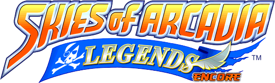
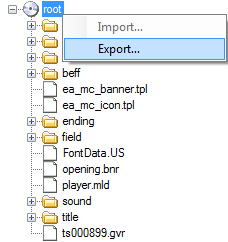
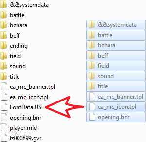
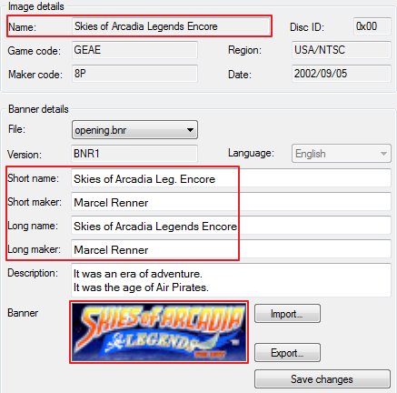
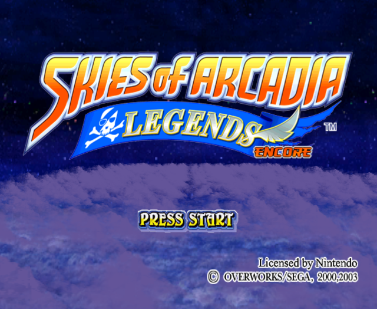
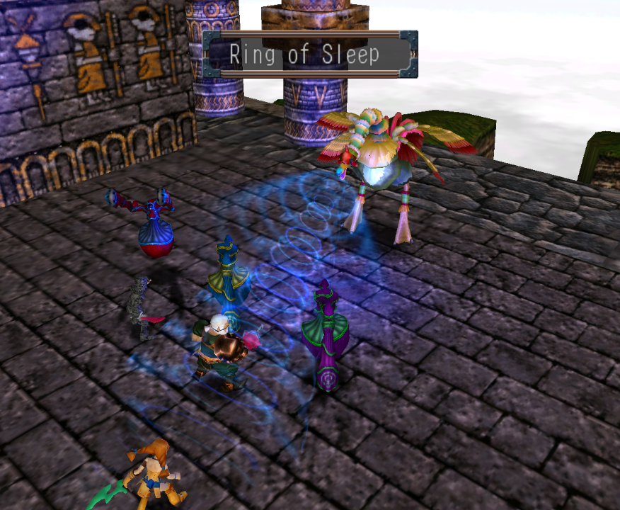

> :warning: **Pre-Alpha In Development Content**  
> Skies of Arcadia Legends Encore is still in development. Use at your own 
> risk and for testing purposes only. Expect that game saves will not be 
> compatible with future releases.

# Skies of Arcadia Legends Encore

Skies of Arcadia Legends Encore also known as Eternal Arcadia Legends Encore 
(エターナルアルカディアレジェンドＥｎｃｏｒｅ) is a rebalancing and difficulty hack.

## Element Efficiency

The elements have been significantly rebalanced compared to the original game, 
which opens up new strategic possibilities. Also, your party members now have 
strengths and weaknesses against specific attributes, which must be considered 
when choosing the right strategy. The chart below indicates the effects of 
attacking with attributes and defending with certain party members.

| Enemy   | Attack With  | Avoid Attacking | Defend As      | Avoid Defending |
|:-------:|:------------:|:---------------:|:--------------:|:---------------:|
| ![][Gr] | ![][R]![][S] | ![][B]![][Y]    | ![][Vy]![][Ai] | ![][Fi]![][Gi]  |
| ![][Re] | ![][P]![][B] | ![][G]![][R]    | ![][Dr]![][En] | ![][Vy]![][Gi]  |
| ![][Pu] | ![][R]![][Y] | ![][P]![][B]    | ![][Vy]![][Gi] | ![][Ai]![][En]  |
| ![][Bl] | ![][G]![][P] | ![][R]![][S]    | ![][Fi]![][Gi] | ![][Dr]![][En]  |
| ![][Ye] | ![][G]![][S] | ![][P]![][Y]    | ![][Fi]![][En] | ![][Ai]![][Dr]  |
| ![][Si] | ![][B]![][Y] | ![][G]![][S]    | ![][Ai]![][Dr] | ![][Vy]![][Fi]  |

[G]: doc/greenstone.png "Green"
[R]: doc/redstone.png "Red"
[P]: doc/purplestone.png "Purple"
[B]: doc/bluestone.png "Blue"
[Y]: doc/yellowstone.png "Yellow"
[S]: doc/silverstone.png "Silver"
[Vy]: doc/vyse.png "Vyse (Blue)"
[Ai]: doc/aika.png "Aika (Yellow)"
[Fi]: doc/fina.png "Fina (Silver)"
[Dr]: doc/drachma.png "Drachma (Green)"
[En]: doc/enrique.png "Enrique (Purple)"
[Gi]: doc/gilder.png "Gilder (Red)"
[Gr]: doc/greencrest.png "Green"
[Re]: doc/redcrest.png "Red"
[Pu]: doc/purplecrest.png "Purple"
[Bl]: doc/bluecrest.png "Blue"
[Ye]: doc/yellowcrest.png "Yellow"
[Si]: doc/silvercrest.png "Silver"

## Prerequisites

* GCM or ISO image of Skies of Arcadia Legends or Eternal Arcadia Legends
  (エターナルアルカディアレジェンド)
* [GCRebuilder](http://www.romhacking.net/utilities/619/)

## Download

> :warning: **Pre-Alpha In Development Content**  
> Skies of Arcadia Legends Encore is still in development. Use at your own 
> risk and for testing purposes only. Expect that game saves will not be 
> compatible with future releases.

* Latest official release on the
  [SourceForge project website](https://sf.net/projects/soale)
* Current development version from the
  [GitHub repository](https://github.com/Taikocuya/SOALE)

## Installation

1. Obtain a GCM or an ISO of Skies of Arcadia Legends or Eternal Arcadia 
   Legends (エターナルアルカディアレジェンド).
2. Download [GCRebuilder](http://www.romhacking.net/utilities/619/) from
   ROMhacking.net.
3. Run GCRebuilder, select `Image > Open` and choose your GCM or ISO image.
4. Note the content of the `Region` attribute for later, which may be 
   `EUR/PAL`, `JAP/NTSC` or `USA/NTSC`.  
   
5. Right-click on `root` in the tree structure, select `Export` and extract 
   the files to any directory wherever you want. A new folder called `root` 
   with all game contents will be created. After the export is finished, 
   choose `Image > Close`.  
   
6. Open the correct `dist/gc-*-final/gameroot` directory which match with 
   your `Region` attribute from step 4 and copy all contents of that folder.
    * `dist/gc-eu-final/gameroot` for `EUR/PAL` region 
    * `dist/gc-jp-final/gameroot` for `JAP/NTSC` region 
    * `dist/gc-us-final/gameroot` for `USA/NTSC` region 
7. Paste all contents into your extracted `root` folder from step 5 and 
   replace the files.  
   
8. In GCRebuilder, select `Root > Open` and choose your modified `root`
   folder from step 7. If you have done everything right, you are able to 
   read `Encore` in the `Name` and `Banner` attributes.  
   
9. Select `Root > Save`, save the file wherever you want and run 
   `Root > Rebuild`. GCRebuilder will compile a new working ISO image that you 
   can use in Dolphin Emulator, Nintendont or any other Gamecube emulation 
   software.

## Resources

## Acknowledgments

See [CREDITS.md](CREDITS.md) for a full list of the awesome people, groups and 
software that made this project possible.

## License

Copyright (C) 2024 Marcel Renner. Skies of Arcadia Legends Encore is 
licensed under the zlib license. See [LICENSE.md](LICENSE.md) for the full 
license text.
